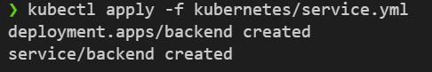

# Java-Microservices

Using diferent frameworks for microservice

reference book "Microservices for Java Developers - 2nd edition"

Technologies:
- Spring-boot
- OpenJDK 11, 8
- Docker
- Kubernetes

Using Visual code with devcontainer for fast work...

## Resume
4 ProJects in Java:
- Api-Gateway
- one-msa-springboot
- hello-thorntail
- backend

Diagram:

# Starting

## Communication:

## The SpringBoot Microservices

Detail:
Using Spring-Boot CLI for init project.
Using REST Template to handle the Backend response
Using Rest Controllers for Rest 
USing Properties vars for ENVS (it's can be changed when build or call de Docker image).
Using Kubernetes with:
    -pods, labels, ReplicationControllers, and Services

Run
    
    mvn clean spring-boot:run

Run in diferent port so it doesn't collide with the backend service (running in port 8080)

    mvn clean spring-boot:run -Dserver.port=9090

## The Backend (with maven wildfly)

Backend using servlet, code from book. I update jaeger-version to 1.5 and refactor BackendHttpServlet.java
using new methods and implement try catch (IOException) in doGet Method.

Run:

    mvn wildfly:run

Result

## The ThornTail (The MicroProfile implementation from Red-Hat)

Using ThornTail with Microprofile config and JAX-RS

For Run

    mvn thorntail:run

Test in port 8280:

    mvn thorntail:run \
    -Dswarm.network.socket-binding-groups.standard-sockets.port-offset=200

# Kubernetes

Using minikube

    minikube start

With this kubectl start working with minikube context.

## Docker build

Docker build for backend project

    docker build -t rhdevelopers/backend:1.0 .

Docker build for springboot project

    docker build -t rhdevelopers/one-msa-springboot:1.0 .

Docker builf fro ThornTail MicroService

    docker build -t rhdevelopers/hello-microprofile:1.0 .

If you want to test one image:

    docker run -it --rm \
    -p 8080:8080 rhdevelopers/one-msa-springboot:1.0

## Kubernetes

Create new POD for backend (cd backend)

    kubectl apply -f kubernetes/service.yml

Example:

